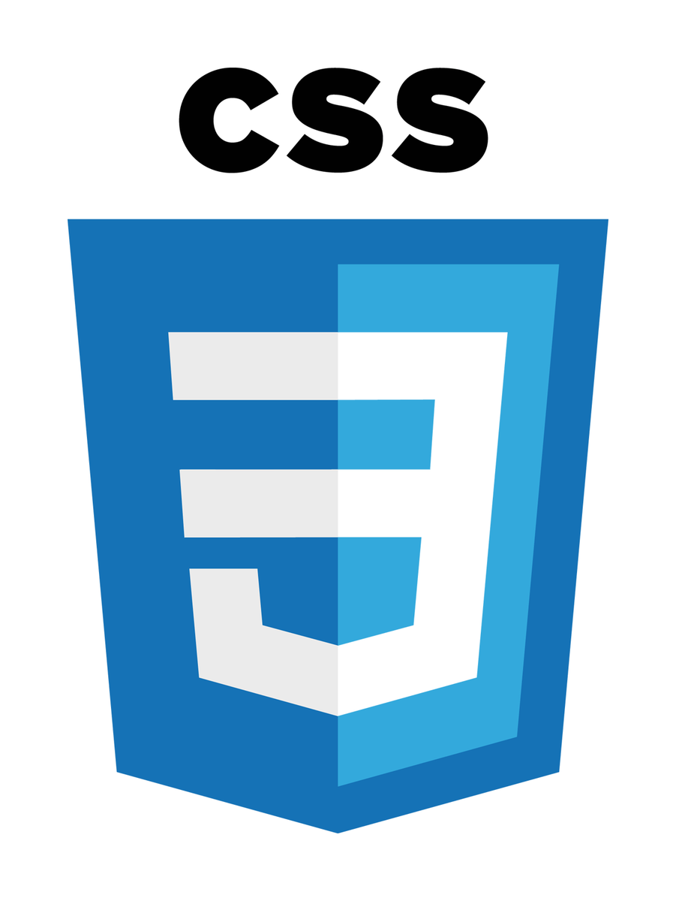

<h2 align="center">Languages</h2>

    
    
    
    

<h6 align="center">HTML / CSS / javaScript / TypeScript</h6>

<h2 align="center">Lib/Framework</h2>

    
    
    

<h6 align="center">Three.js / Vue.js / Sass</h6>

<h2 align="center">Tools</h2>

    
    
    
    
    

<h6 align="center">Git / GitHub / Figma / Vs-code</h6>

<h2 align="center">Front-end</h2>
<h6 align="center">Vue js</h6>

<h2 align="center">Back-end</h2>
<h6 align="center">Coming Soon... </h6>

#### I'm currently learning.. (in order) :runner:
    .API Backend
    .Smarts Contracts
    .Deep learning with tensorflow.js
    .Advanced Mathematics

#### online CV
    https://etc/etc

#### E-mails 💬
    bastienv.capital@gmail.com

#### Contact me 💬
    Instagram
    Linkedin
    Discord

###### J’aime celui qui a honte de voir le dé tomber en sa faveur et qui demande alors : suis-je donc un faux joueur ? car il veut son déclin.