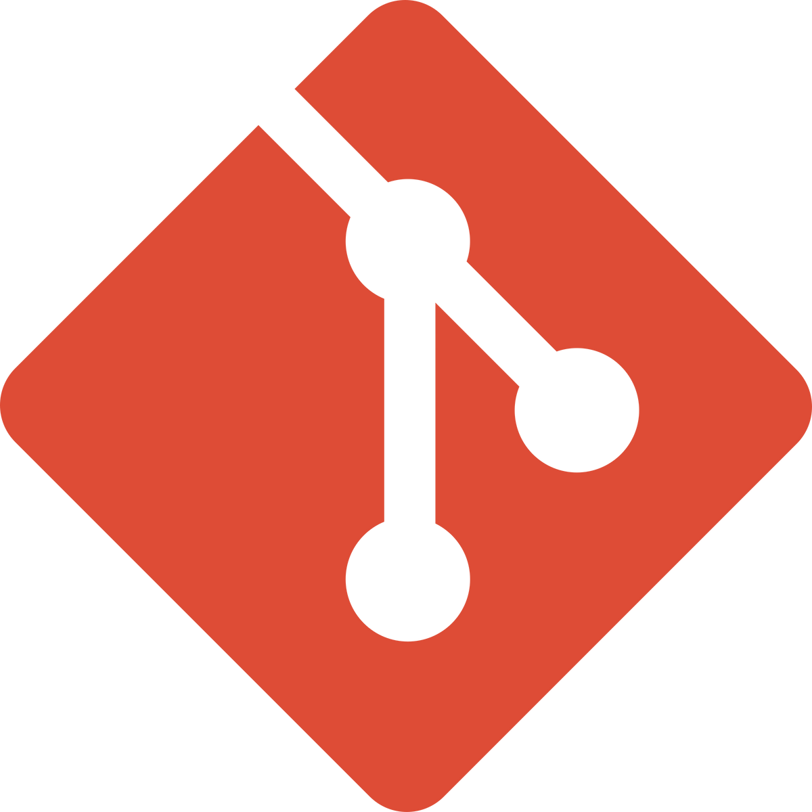
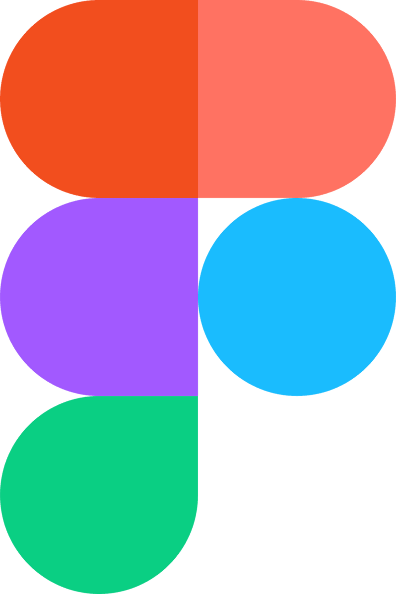

<h1 align="center">
Hey, welcome to my realms!

</h1>

<h6 align="center">I'm in love with philosophy but don't tell anyone... :pill:</h6>

<h2 align="center">Languages</h2>

    
    
    

<h6 align="center">
HTML / CSS / javaScript / TypeScript / Python
</h6>

<h2 align="center">Libs/Frameworks</h2>

    
    
    

<h6 align="center">Node.js / Vue.js / Sass / Three.js</h6>

<h2 align="center">Tools</h2>

    
    
    
    

<h6 align="center">Git / GitHub / Figma / Vs-code / Yarn / npm</h6>

<h2 align="center">Front-end</h2>
<h6 align="center">VUE JS</h6>

<h2 align="center">Back-end</h2>
<h6 align="center">Coming Soon... </h6>

#### I'm currently learning.. (in order) :runner:
    .API Backend
    .Smarts Contracts
    .Deep learning with tensorflow.js
    .Advanced Mathematics

#### E-mails :question:
    bastienv.capital@gmail.com

#### Online-CV :pencil:
link coming soon

#### Online-Biography :book:
link coming soon

###### J’aime celui qui a honte de voir le dé tomber en sa faveur et qui demande alors : suis-je donc un faux joueur ? car il veut son déclin.
