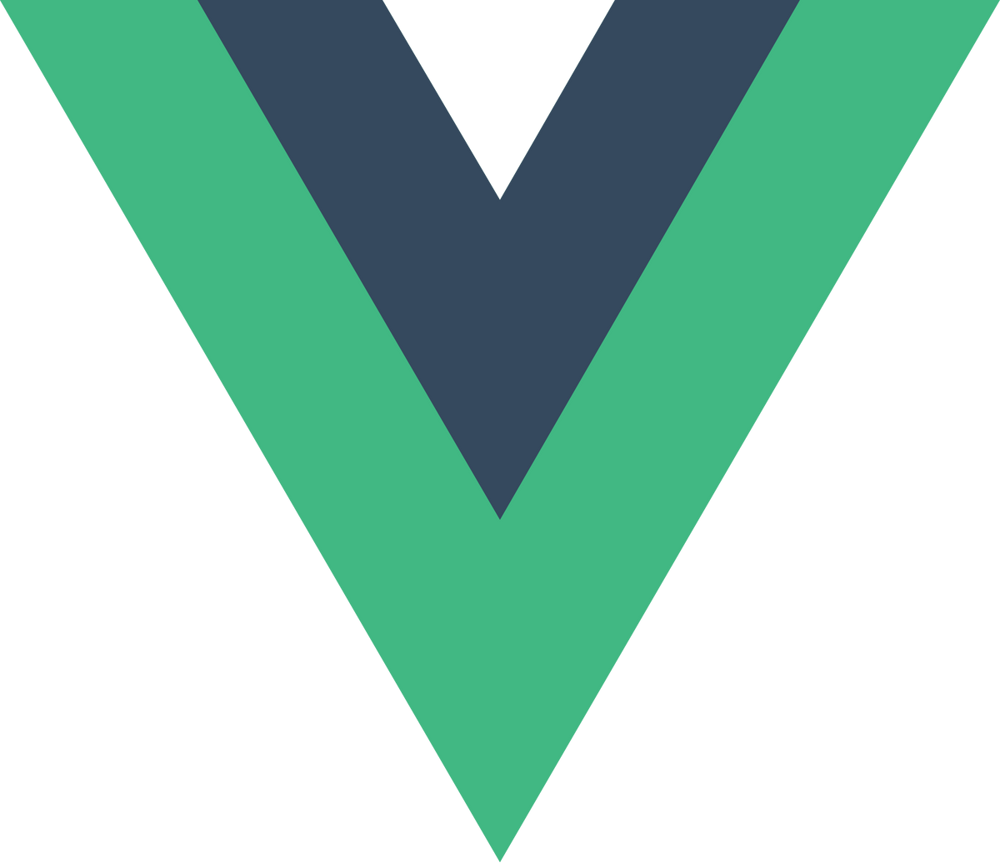

<h6 align="center">I'm in love with philosophy but don't tell anyone... :pill:</h6>

<h2 align="center">Languages</h2>

    
    
    

<h6 align="center">
HTML / CSS / javaScript / TypeScript / Python
</h6>

<h2 align="center">Libs / Frameworks / Tools</h2>

    
    
    
    
    
    
    

<h6 align="center">Node.js / Vue.js / Sass / Three.js / Git / GitHub / Figma / Vs-code / Yarn / npm</h6>

#### E-mails :question:
    bastienv.capital@gmail.com

<a href='https://github.com/BastienVanhove/Portfolio'>Go Check My Portfolio! (click here)</a>

<h6 align="center"> 
J’aime celui qui a honte de voir le dé tomber en sa faveur et qui demande alors : suis-je donc un faux joueur ? car il veut son déclin.
</h6>
